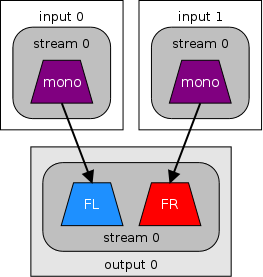
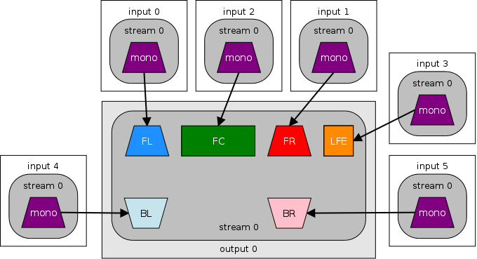

# Introduction

This guide is for the traditional/most common style of P2P file and release names. This isn't the same format that EVERYONE uses, for example a noteworthy group that uses a different format is FraMeSToR.

# Quick Examples

- TV Episode File: Fosters.Home.for.Imaginary.Friends.S06E02.Mondo.Coco.1080p.HMAX.WEB-DL.DDP.2.0.H.264-PHOENiX
- Movie File: Mulan.2020.1080p.DSNP.WEB-DL.DDP.Atmos.5.1.H.264-PHOENiX

# The format and explanation on it's values

TV Episode Syntax: `<Title> <Year*> <Season and Episode> <Episode Title> <Resolution and Scan Type> <Source> <Audio Codec and Channels> <Video Codec>-GROUPTAG`

Movie Syntax: `<Title> <Year> <Resolution and Scan Type> <Source> <Audio Codec and Channels> <Video Codec>-GROUPTAG`

DVD or Blu-ray Backup Syntax: `<Title> <Year*> <Resolution and Scan Type> <Source> <Video Codec> <Audio Codec and Channels>-GROUPTAG`

> Note: Please notice that Audio Codec and Video Codec swap positions on DVD and Blu-ray backups compared to episode and movie files.

Details:

## 1. Title

This is the main title or name of the show. For example, `The Exorcist`. Do note however, for title's that are originally recorded in a foreign language some places do like to do for example `The Exorcist AKA Egzorcysta` (`Dub AKA Original Title`), this is to accomodate searching for both the original and the dubbed title.

## 2. Year

> Note: Don't do the following on TV Episode File's or TV DVD/Blu-ray Backups unless there's 2 TV Show's with the exact same Title name.

Simply the first air date of the show, typically the original air date in the original country it aired on, for example, Pokémon Episode 1 aired in 1997 in Japan but first aired in 1998 in the US, you would use 1997 here as that's the original air date. Typically what's stated as the year on TMDb or IMDb would be the one to use.

## 3. Season and Episode (TV Episodes Only)

The format for this is `SXXEYY`. Always pad-left with one zero so that it's at minimum a double-digit. You can go beyond double digits into the 100's however do not pad-left beyond double-digits.

`XX` is the Season Number and so `YY` is the Episode Number.

To specify multiple episodes we have two ways, by RANGE or by simply specification. For example, If I have a file that is actually the first two episodes of Season 1 it would be `S01E01E02` or `S01E01-E02`, you can typically use either of them, it's up to you, I like to use the second option as it has a tiny bit better support on systems like Sonarr, Plex, Emby, though that could have changed by the time your reading this, either way it has a bit more readability for only 1 extra character so I don't mind it.

For ranges, you can also specify that a file has more than 2 episodes, for example let's say it's the first 5 episodes in a single file: `S01E01-E05`.

## 4. Episode Title (TV Episodes Only)

This is the name of the episode. Make sure to convert `&`'s to `and` as `&` is considered an unusable character on some file systems and not only that but it's sometimes used on multi-episode files to seperate episode titles for each episode, if you have an `&` in that episode name it complicates the readability of it.

> Note: If you had multiple episode numbers specified, then make sure to seperate the episode titles explained below with "&nbsp;&&nbsp;" (with the spacing), e.g. `Yesterday's Jam & Calamity Jen`.

## 5. Resolution and Scan Type

For example, `1080p` is `1080` as the resolution and `p` as the Scan type. `p` is not always going to be the correct choice. Use `p` if the content is fully Progressive, use `i` if it's Interlaced, or finally `m` if it's MBAFF interlacing.

Some groups don't realise `m` is meant to be used for MBAFF and use `i` anyway since it is still interlacing and you would probably get away with it but do know that MBAFF interlacing is nowhere near as bad as regular Interlacing, it's nowhere near as jarring to the image vertical quality so the distinction would be nice.

## 6. Source

This is where you would go and look into how source formats are as each source of the video contents have different formats for this Source area. Here's a couple common ones:

- DVD, but a full backup: e.g. `3xDVD9 DVD5` this means there's three DVD9 dics and one DVD5 disc.
- DVD, but REMUXED: `DVD REMUX`
- DVD, but Encoded: `DVD`
- Blu-ray, but a full backup: `Blu-ray` (it was very common to be `BluRay` leading to confusion but has since shifted to `Blu-ray`)
- Blu-ray, but REMUXED: `BluRay REMUX`
- Blu-ray, but Encoded: `BluRay`
- Untouched Decrypted download from a WEB source (paid or free): `<Source Tag> WEB-DL`
- Screen Capture, Capture Card Capture, or an encode of a WEB-DL: `<Source Tag> WEBRip`

### Source Tags

These are very short identifier's that the P2P community agreed upon to use. These source tags are pretty much always 2 to 4 characters. Here's a very short example list.

- Amazon: `AMZN`
- Netflix: `NF`
- Disney+: `DSNP`
- HBO MAX: `HMAX`

### Source suggestions that better get adopted eventually!!

Currently `BluRay` or `Blu-ray` is used, why? What the actual fuck? `VHS`, `DVD` e.t.c has been used so far, why is `BluRay` used over `BD`? Like what the fuck? Are they high? `DVD` means `Digital Versatile Disc` and `BD` means `Blu-ray Disc` so what the fuck made them not follow this? They would even save some filename length which Scene especially loves to do... What's crazy too is UHD Blu-ray is out now which makes this shit even more confusing, UHD Blu-ray's are typically known as UBD's, so it would literally be a perfect transition unlike it is now with everyone specifying `UHD Blu-ray` making filenames even longer!! *angry face!!* grrr

Blu-ray encodes should also be more specific as the current use conflicts with full disc backups. Perhaps `BDRip` (which you may ask isn't that in use? No! That's `BRRip`, which is used for encodes of encodes of Blu-rays).

If that doesn't work, then why aren't we adopting `BD` as mentioned above and then doing for example, `2xBD50 BD25` just like the DVD capacity format? That would result in the conflict being a lot less. It makes no bloody sense whatsoever why it's currently the way it is, and why it's been like this for so long!

## 7. Audio Codec and Channels

This is the Audio Codec and Channel Layout information.

### The Codec

The audio codec is typically in a shortened format, for example "Dolby Digital+" is specified as "DDP" or in some rare P2P cases "DD+" (which I don't recommend just in case it has issues on some file systems with the +).

Here's a list of some common examples:

- Dolby Digital (AC-3): `DD`
- Dolby Digital+ (E-AC-3): `DDP`
- Dolby Digital+ Atmos (E-AC-3 JOC): `DDP Atmos`
- Dolby TrueHD (MLP FBA): `TrueHD`
- Dolby TrueHD (MLP FBA 16-ch): `TrueHD Atmos`
- DTS-HD Master Audio (DTS XLL): `DTS-HD MA`

### The Channel Info

The channel information is simply a single-decimal (e.g. n.n) which specifies the channel layout as well as channel count.

If you're using MediaInfo to read channel layout information, you can read up on [How MediaArea reads channel layouts](https://mediaarea.net/AudioChannelLayout).

#### Stereo (2.0)

#### Surround (5.1)

#### The entire channel layout diagram

# 8. Video Codec

There's two places you need to pay attention to when getting the video codec from MediaInfo. "Codec" and "Writing library", which may not show up.

If you have Writing library metadata, it states the application name and possibly encoding settings e.t.c. If the application name is any of the following, use it instead of "Codec":

- x264
- x265
- *There are other application names like ATEME and Zencoder however those just use the regular codec name*

If it's not sourced from a home-media disc (DVD, Blu-ray, e.t.c) and so far the Codec you have is "AVC", "HEVC", e.t.c, then it's generally recommended to name it the ITU counterpart, so in this case H.264, H.265 respectively, why? I have no idea, it's just a thing that seems to be common, perhaps phase this out?

One more little tip, if you're dealing with an MPEG-1/MPEG-2 codec video, specify simply "MPEG" as the codec unless it's MPEG format version 1 (MPEG-1). Most MPEG codec videos are format version 2, especially DVD's and Blu-ray's. If you specify `MPEG` everyone will know what you mean and to expect MPEG-2 with the watchable resolution and bitrate, but when it's an `MPEG-1` video file and you specify it, everyone will know its in a restricted resolution and low bitrate. There's no need to spend an extra 2 chars for `-2` when 99% of the time it will be an MPEG-2 video.

# 9. Group Tag

This is your (hopefully unique) team/group identifier referred to as a tag. All your releases should use the same tag. This is where you credit you and your group for the effort.

There's no rules really when it comes to this though typically you use just a-zA-Z0-9 and numbers are pretty uncommon. It's also stylistic to be mostly if not entirely uppercase.

e.g. ...AVC-PHOENiX looks a lot better than ...AVC-Phoenix

# 10. Finally clean up the output.

So far I've been telling you to just space everything, no `.`'s e.t.c, We need to change that.
While it's not really necessary nowadays to replace spaces with `.`'s it's still done by almost every group to ensure the files they provide can be used by everyone no matter their setup.

Make the following changes in order to the entire text:

1. Remove the following characters (do not replace them): `!?,'*():` (these are unsupported on NTFS, and mix of these on other file systems).
2. Replace any double-space `··` to a single space `·`.
3. Replace all remaining spaces with a `.`.
